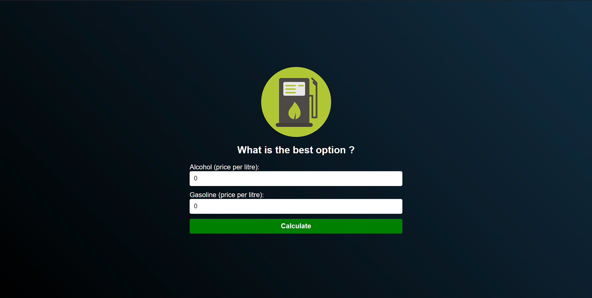

<h1 align="center"> fuel calculator </h1>

# 🛠️ Open and run the project

**have NodeJS installed on the system.**

**Open the project terminal and type "npm install".**

**After installing, run the project with " npm run dev" .**

